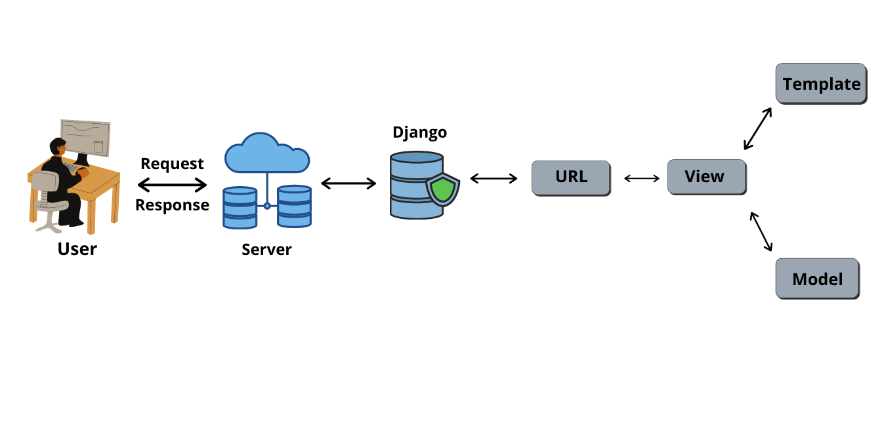

# Inmanage

InManage is employees management page for restaurant managers.

## Getting Started
The following instructions are needed for you to set up it locally

### Prerequisites
1. Install python
2. Install pip
3. Install virtualenv

### Starting the Development Server
1. Make virtualenv by running: python -m venv env
2. Activate it by running: source env/bin/activate
3. Run setup.sh that will install needed dependencies and configure
4. Run server: python manage.py runserver
5. Open Web Client

## Infrastructure

## About InManage
1. Contains 3 pages: Login, Manage Employees and Profile Page
2. Built by using HTML, CSS and JS (only in one place) with Django framework, used SQLite3. 
3. Login Page is rendered by client-side and the rest pages are server-side rendered
4. Deployed by benefiting from render.com
